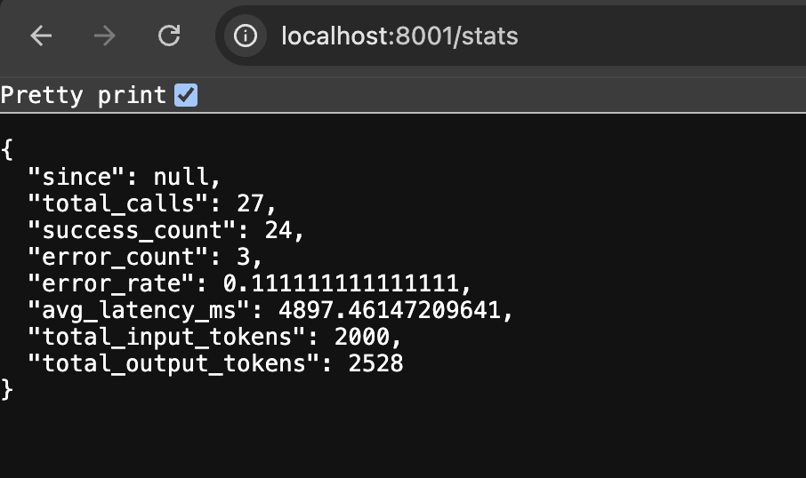

# chatbot-app

A lightweight **LLM inference logging & ingestion system** — a chatbot whose
every model call is auto-instrumented, shipped out of the request path, and
persisted for observability. Built slowly and steadily as a learning project;
see [`LEARNING_PLAN.md`](./LEARNING_PLAN.md) for the rung-by-rung roadmap and
[`ARCHITECTURE.md`](./ARCHITECTURE.md) for the architecture notes.

**Stack:** FastAPI (Python) · Anthropic (Claude) / Google (Gemini) · Postgres +
SQLModel · plain HTML/JS UI (no framework, on purpose — every layer stays visible).

## Architecture overview

Two independent FastAPI services share one Postgres database:

- **chatbot** (`app/`, port 8000) — serves the UI and the `POST /chat` endpoint,
  persists `conversations` + `messages`, and exposes reads for the UI
  (`GET /conversations`, `GET /conversations/{id}`).
- **ingestion** (`ingestion/`, port 8001) — receives inference logs, validates
  them, stores `inference_logs`, and serves `GET /stats`.

Every Claude call goes through **`TracedClient`** (the SDK wrapper, see
[`sdk/DESIGN.md`](./sdk/DESIGN.md)), which captures a structured `InferenceLog`
and hands it to a **`QueueSink`**: the event is enqueued instantly and a
background thread ships it to ingestion over HTTP, so log delivery can be slow or
fail **without ever blocking or breaking the chat**. The chatbot writes
`conversations` + `messages`; ingestion writes `inference_logs` — each service
owns its own tables (details in [`db/DESIGN.md`](./db/DESIGN.md)).

```
browser ──▶ chatbot :8000 ──(TracedClient → QueueSink, async)──▶ ingestion :8001
   ▲            │  writes conversations, messages                     │ writes
   └── UI ──────┘                     Postgres  ◀───────────────────── inference_logs
                          reads: /conversations, /conversations/{id}, /stats
```

See [`ARCHITECTURE.md`](./ARCHITECTURE.md) for the full ingestion flow, logging
strategy, scaling considerations, and failure-handling assumptions.

## Features

- **Chatbot:** multi-turn conversations with short context (last N messages),
  persisted to Postgres (survives restarts).
- **Auto-instrumenting SDK:** a transparent `TracedClient` wrapper captures
  model, provider, latency, tokens, status/errors, timestamps, session ID, and
  input/output previews — chat code carries zero logging concerns.
- **Multi-provider:** Anthropic and Google Gemini, switchable **per request from
  a UI dropdown** (or via `LLM_PROVIDER`/`LLM_MODEL` for the default). Only
  providers with a configured key are offered. Since history is provider-agnostic
  you can switch mid-conversation — Gemini will continue a chat Claude started.
  Each provider's quirks live in a small adapter (`sdk/providers.py`); the
  wrapper returns a normalized result, so the chat code is provider-agnostic.
- **Near-real-time ingestion:** non-blocking, failure-safe log shipping to a
  separate ingestion service that validates and stores each log.
- **UI:** a single-page chat with a conversation sidebar — **list** past
  conversations and **resume** any of them. Assistant replies render as markdown;
  a typing indicator shows while awaiting a reply.
- **Observability dashboard:** a CloudWatch-style console at `/dashboard`
  (served by ingestion) — KPI cards, throughput/latency charts, a by-model
  breakdown, and a filterable, expandable **log explorer** to diagnose failures
  and inspect calls. See [`DASHBOARD_DESIGN.md`](./DASHBOARD_DESIGN.md).

## Quick start with Docker (recommended)

One command brings up Postgres + both services (schema is created automatically
by a one-shot `db-init` step):

```bash
cp .env.example .env        # then edit .env: paste your ANTHROPIC_API_KEY
docker compose up --build
```

Then open **http://localhost:8000**. Inside Compose the services find each other
by name — `DATABASE_URL` and `INGESTION_URL` are set for you; only
`ANTHROPIC_API_KEY` is read from your `.env`. Stop with `Ctrl-C`; `docker compose
down` removes the containers (add `-v` to also drop the Postgres volume).

Get an API key at https://console.anthropic.com/ (Settings → API Keys).

## Manual setup (without Docker)

Prerequisites: Python 3.11+ and a running **Postgres** server (any local
Postgres works).

```bash
python3 -m venv .venv
source .venv/bin/activate
pip install -r requirements.txt

cp .env.example .env        # then edit .env: paste your API key (+ DATABASE_URL)

createdb chatbot            # create the database (if it doesn't exist)
python -m db.init           # create the tables (one-time)
```

`DATABASE_URL` defaults to `postgresql+psycopg://<your-os-user>@localhost:5432/chatbot`.

Then run the two services in two terminals (both from the project root, venv
activated):

```bash
# terminal 1 — ingestion service
uvicorn ingestion.main:app --port 8001 --reload

# terminal 2 — chatbot
uvicorn app.main:app --port 8000 --reload
```

Then open **http://localhost:8000** for the chat UI. The chatbot persists
conversations and messages to Postgres and ships each inference log to the
ingestion service (`INGESTION_URL`, default `http://127.0.0.1:8001/logs`), which
stores it in `inference_logs`.

### Switching providers

Default is Anthropic. To use Gemini, set a key and the env vars — no code change:

```bash
GEMINI_API_KEY=...    # in .env; get one at https://aistudio.google.com/apikey
LLM_PROVIDER=gemini uvicorn app.main:app --port 8000   # LLM_MODEL optional (default gemini-2.0-flash)
```

## Endpoints

| Method & path | Service | Purpose |
|---|---|---|
| `GET /` | chatbot | The chat UI (single page) |
| `GET /providers` | chatbot | Available providers (with keys) + default, for the UI dropdown |
| `POST /chat` | chatbot | Send a message (optional `provider`); returns reply + `session_id` |
| `GET /conversations` | chatbot | List conversations (preview + message count), newest-active first |
| `GET /conversations/{id}` | chatbot | Full message history for a session (resume) |
| `POST /logs` | ingestion | Receive + validate + store an inference log |
| `GET /stats?since=` | ingestion | Aggregates: calls, error rate, avg + p50/p95/p99 latency, tokens |
| `GET /stats/timeseries?since=&bucket=` | ingestion | Per-bucket calls/errors/avg-latency (charts) |
| `GET /stats/by_model?since=` | ingestion | Per-model calls, error rate, avg latency |
| `GET /logs?status=&provider=&model=&session_id=&q=&since=&limit=&offset=` | ingestion | Query the log stream (filtered, paginated, newest-first) |
| `GET /dashboard` | ingestion | The observability console (charts + log explorer) |

Inspect the data directly:

```bash
psql chatbot -c "select role, content from messages order by id;"
psql chatbot -c "select model, status, latency_ms, input_tokens, output_tokens from inference_logs;"
curl -s http://localhost:8001/stats | python -m json.tool
```

## Tests

```bash
pip install -r requirements-dev.txt
python -m pytest -v
```

Tests make no real API calls and open no network connections. They run against
**in-memory SQLite** (via SQLModel + a FastAPI dependency override), so no
Postgres server is needed. The `TracedClient` tests pass a **fake** client and
sink; the ingestion/reads/stats tests use FastAPI's `TestClient` and assert both
the contract and that data is actually stored/returned. The code is testable
because the client, sink, and DB session are injected — good design and
testability go together.

## Demo

The chat UI at http://localhost:8000 — send a message and watch the reply stream
in, switch providers, and list/resume past conversations from the sidebar.

| | |
|---|---|
|  |  |
| **Chat** — markdown reply + provider dropdown | **Streaming** — live tokens + Cancel |
|  |  |
| **List + resume** conversations | **Stats** — latency / throughput / errors |

## Schema design decisions

Three tables, each owned by the service that produces the data:

- `conversations` / `messages` — owned by the **chatbot** (transactional app data).
- `inference_logs` — owned by the **ingestion** service (append-only telemetry).

Messages and inference logs are kept in **separate tables on purpose**: they are
different kinds of data with different volume, lifecycle, and scaling needs. A
conversation is app state a user cares about; an inference log is observability —
one row per LLM call, including retries and errors that never became a visible
message. `inference_logs.session_id` is a plain indexed column, **not** a foreign
key, because telemetry is written independently and may reference a session with
no conversation row.

The **wire model** (`sdk/events.py::InferenceLog`, pure Pydantic) is separate from
the **storage model** (`db/models.py::InferenceLogRow`, SQLModel), so the
transport contract and the database schema can evolve independently.

Indexes are chosen for the queries actually run: `messages(session_id)`,
`inference_logs(session_id)`, `inference_logs(started_at)` (time-series),
`inference_logs(status)` (error rate).

Schema creation is a one-time `python -m db.init` step, **not** done on app
startup — two services racing to `CREATE TABLE` on boot causes a concurrent-DDL
error, and schema is a single-owner concern.

## Tradeoffs & what I'd improve with more time

- **No versioned migrations yet:** schema is created with SQLModel `create_all`
  via `python -m db.init`. A real system would use **Alembic**.
- **In-process queue:** log shipping is non-blocking and failure-safe, but the
  queue lives in the process — a crash loses queued events, and there is no retry
  or persistence. An **external durable broker** (event-based architecture) would
  add durability + back-pressure.
- **Explicit wrapper, not true auto-instrument:** capture is a transparent
  `TracedClient`. A **monkey-patch / OTel instrumentor** (aligned to the
  OpenTelemetry GenAI semantic conventions) would make instrumentation
  zero-touch. A **proxy** approach (à la Helicone) is the other option.
- **Provider coverage:** Anthropic + Gemini are wired via adapters; adding
  another (OpenAI, etc.) is one more adapter. A library like **litellm** would
  replace the hand-rolled adapters in production.
- **UI markdown is not sanitized:** assistant output is rendered via `marked`
  into `innerHTML`. Safe here (our own model's output), but production would run
  it through a sanitizer like **DOMPurify**.
- **Dashboard aggregation runs in Python:** percentiles and time-buckets are
  computed in the app (DB-agnostic, so tests run on SQLite). Fine at this scale;
  at high telemetry volume you'd push them into SQL and/or a columnar store
  (ClickHouse) — the OLAP read path real tools use.
- **Logs store previews, not full payloads:** the log explorer diagnoses from
  input/output **previews (~200 chars)** + `error_type`/`error_message`, not full
  request/response bodies — a deliberate storage/privacy tradeoff. Production
  would store full payloads (with PII redaction) or link to a trace store.
- **Hosting/deploy:** there's a one-command `docker compose up` for local dev
  (Postgres + both services); a hosted deployment (e.g. self-managed k8s) is a
  remaining bonus.
