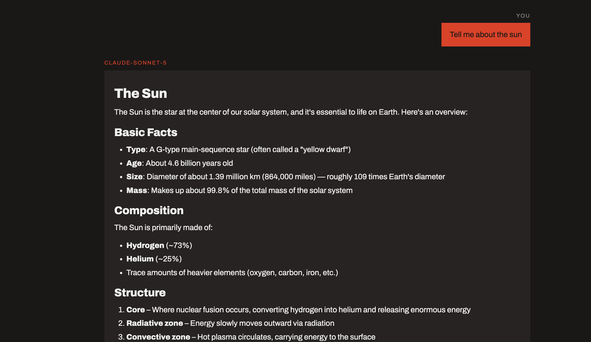
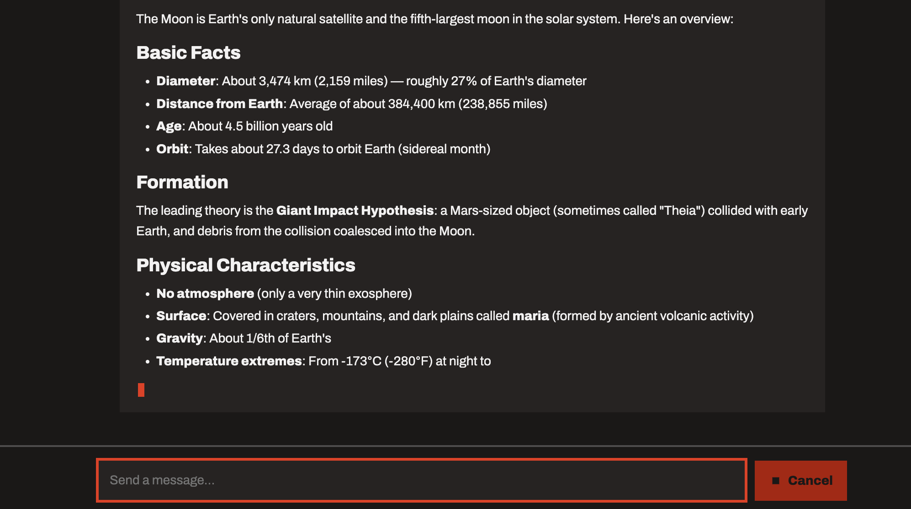
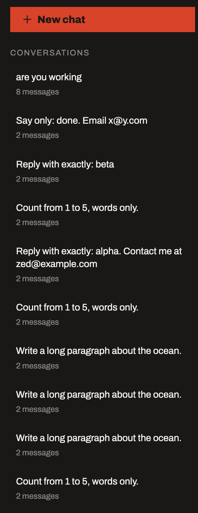
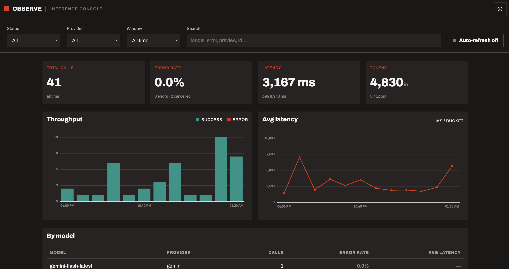
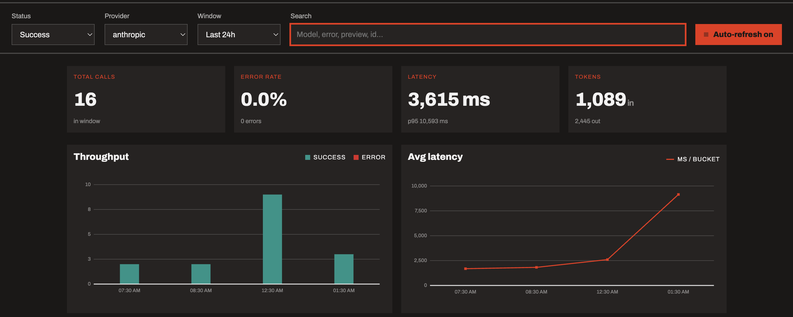
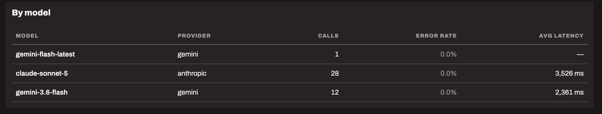

# LLM inference logging & ingestion

A chatbot whose every model call is **auto-instrumented** — captured by patching
the provider SDK, so the application code carries no logging concerns at all —
then shipped out of the request path and persisted for observability, plus the
console to inspect it.

**Stack:** FastAPI · Anthropic (Claude) + Google (Gemini) · Postgres + SQLModel ·
Redis Streams · React + TypeScript (Vite) · Docker Compose

- [`ARCHITECTURE.md`](./ARCHITECTURE.md) — ingestion flow, logging strategy,
  scaling considerations, failure-handling assumptions
- [`docs/`](./docs/) — per-component design rationale

## Contents

[Quick start](#quick-start-docker) · [Manual setup](#manual-setup-without-docker)
· [Architecture overview](#architecture-overview) · [Endpoints](#endpoints) ·
[Schema design decisions](#schema-design-decisions) · [Tests](#tests) ·
[Demo](#demo) · [Tradeoffs](#tradeoffs) ·
[What I'd improve with more time](#what-id-improve-with-more-time)

## Quick start (Docker)

One command brings up Postgres, Redis, both services, and the broker worker:

```bash
cp .env.example .env        # then edit .env: paste your ANTHROPIC_API_KEY
docker compose up --build
```

- **http://localhost:8000** — chat UI
- **http://localhost:8001** — observability dashboard

Get an Anthropic key at https://console.anthropic.com/ (Settings → API Keys), or
set `GEMINI_API_KEY` and `LLM_PROVIDER=gemini` to run on Gemini instead. Keys for
both means the UI offers a per-request provider switch.

Inside Compose the services find each other by name; `DATABASE_URL` and
`REDIS_URL` are set for you, and a one-shot `db-init` service creates the schema
before either app starts. `Ctrl-C` stops; `docker compose down -v` also drops the
Postgres volume.

## Manual setup (without Docker)

Prerequisites: Python 3.11+ and a running Postgres.

```bash
python3 -m venv .venv
source .venv/bin/activate
pip install -r requirements.txt

cp .env.example .env        # then edit .env: paste your API key (+ DATABASE_URL)

createdb chatbot            # if it doesn't exist
python -m db.init           # create the tables (one-time)
```

`DATABASE_URL` defaults to
`postgresql+psycopg://<your-os-user>@localhost:5432/chatbot`.

Run the two services in separate terminals, from the project root:

```bash
uvicorn ingestion.main:app --port 8001 --reload   # terminal 1
uvicorn app.main:app       --port 8000 --reload   # terminal 2
```

Without `REDIS_URL` the SDK ships logs over HTTP to `INGESTION_URL`
(default `http://127.0.0.1:8001/logs`) instead of through Redis. Set `REDIS_URL`
and run `python -m ingestion.worker` to exercise the event-based path.

### Frontend development

Both UIs are Vite + React + TypeScript apps that isolate every backend call in
`src/api.ts`. Production serving is handled by the multi-stage `Dockerfile`,
which builds them and lets FastAPI serve the output as static files. For UI work:

```bash
cd frontend  && npm install && npm run dev   # chat UI      → :5173, proxies :8000
cd dashboard && npm install && npm run dev   # dashboard    → :5174, proxies :8001
```

The UIs are builds, not server-rendered pages, so a bare checkout has no `/` to
serve. Docker builds them for you; otherwise run `npm run build` once. If a build
is missing, the API is unaffected — only `/` is, and it returns a 503 explaining
how to build rather than a bare 404.

### Switching providers

Default is Anthropic. For Gemini, set a key and the env vars — no code change:

```bash
GEMINI_API_KEY=...    # in .env; get one at https://aistudio.google.com/apikey
LLM_PROVIDER=gemini uvicorn app.main:app --port 8000
```

`LLM_MODEL` overrides the default model (`claude-sonnet-5` /
`gemini-flash-latest`). Only providers with a configured key are offered in the
UI, and because conversation history is stored provider-agnostically you can
switch mid-conversation — Gemini will continue a chat Claude started.

### Switching instrumentation

| `LLM_INSTRUMENTATION` | Mechanism |
|---|---|
| `patch` *(default)* | Auto-instrumentation: `instrument()` monkey-patches the provider SDK, so capture is ambient and the call site holds no logging concerns |
| `wrapper` | The explicit `TracedClient` wraps each call |

Both record identical `InferenceLog` fields — asserted by parity tests in
`tests/test_app_instrumentation.py` and confirmed live — so this is a safe
rollback rather than a behavioural switch. See
[`docs/auto-instrumentation.md`](./docs/auto-instrumentation.md).

## Architecture overview

Two independent FastAPI services share one Postgres database:

- **chatbot** (`app/`, :8000) — serves the chat UI, runs `POST /chat` and
  `POST /chat/stream`, owns `conversations` + `messages`.
- **ingestion** (`ingestion/`, :8001) — receives, validates and stores inference
  logs, owns `inference_logs`, and serves the dashboard over them.

Every model call is captured by the SDK layer in `sdk/` — by default through a
patched provider client, so the application code has no logging in it — producing
a structured `InferenceLog`, redacting PII from the previews, and handing it to a
`QueueSink` — enqueued instantly, delivered on a background thread, so log
shipping can be slow or fail **without ever blocking or breaking the chat**.
Delivery goes either straight to ingestion over HTTP, or (when `REDIS_URL` is
set) through a **Redis Stream** consumed by a separate worker, which survives an
ingestion or database outage.

```
browser ─▶ chatbot :8000 ──(patched SDK → QueueSink, off the request path)───┐
   ▲          │ writes conversations, messages                              │
   │          ▼                                                    HTTP POST │ or XADD
   │       Postgres ◀── writes inference_logs ── ingestion :8001 ◀───────────┘
   └── UI ─────┘                                     ▲                  (worker drains
                                                     └── dashboard :8001  the stream)
```

[`ARCHITECTURE.md`](./ARCHITECTURE.md) has the full flow, failure assumptions and
scaling notes.

### Capabilities

- **Multi-turn chat** with a short rolling context window (last N messages),
  persisted to Postgres so it survives restarts.
- **Auto-instrumentation — on by default.** Telemetry is captured by
  **monkey-patching the provider SDK**, so nothing in the application times a
  call, reads token usage, or touches a sink. Both call shapes are patched
  (`messages.create` *and* `messages.stream`; `generate_content` and
  `generate_content_stream`), capturing model, provider, latency, TTFT, tokens,
  status/errors, timestamps, session ID and input/output previews. An explicit
  `TracedClient` wrapper is the documented alternative — same captured fields,
  applied visibly — reachable with `LLM_INSTRUMENTATION=wrapper`.
- **Multi-provider** — Anthropic and Gemini behind per-provider adapters,
  switchable per request from the UI.
- **Streaming with cancel** — SSE token streaming; a cancelled stream persists
  the partial reply and records `status="cancelled"` with TTFT.
- **Near-real-time ingestion** — non-blocking, failure-safe shipping over HTTP or
  a durable Redis Stream with an at-least-once worker.
- **PII redaction at the source** — emails, phones, Luhn-valid cards, SSNs, IPs
  and API keys become typed tokens (`[EMAIL]`, `[CARD]`) before a log is emitted.
- **Chat UI** — conversation sidebar with list and resume, markdown replies,
  streaming with a Cancel button, provider selector.
- **Observability dashboard** — KPI cards, throughput and latency charts, a
  by-model breakdown, and a filterable log explorer where the filter bar scopes
  the charts and the log stream identically.

## Endpoints

| Method & path | Service | Purpose |
|---|---|---|
| `GET /` | chatbot | Chat UI |
| `GET /providers` | chatbot | Configured providers + default, for the UI selector |
| `POST /chat` | chatbot | Send a message; returns reply + `session_id` |
| `POST /chat/stream` | chatbot | Same, streamed as SSE (`start` / `delta` / `done` / `error`) |
| `GET /conversations` | chatbot | List conversations, newest-active first |
| `GET /conversations/{id}` | chatbot | Full message history (resume) |
| `POST /logs` | ingestion | Receive, validate and store an inference log |
| `GET /stats` | ingestion | Calls, error rate, avg + p50/p95/p99 latency, tokens |
| `GET /stats/timeseries` | ingestion | Per-bucket calls / errors / avg latency |
| `GET /stats/by_model` | ingestion | Per-model calls, error rate, avg latency |
| `GET /logs` | ingestion | Query the log stream (filtered, paginated, newest-first) |
| `GET /` and `/dashboard` | ingestion | Observability console |

All read endpoints on ingestion accept the same optional filters
(`status`, `provider`, `model`, `session_id`, `q`, `since`), so one filter bar
scopes every panel. Inspect the data directly:

```bash
psql chatbot -c "select role, content from messages order by id;"
psql chatbot -c "select model, status, latency_ms, ttft_ms from inference_logs;"
curl -s http://localhost:8001/stats | python -m json.tool
```

## Schema design decisions

Three tables, each owned by exactly one service — the chatbot owns
`conversations` and `messages`, ingestion owns `inference_logs`. Both connect to
the same Postgres, and neither reads the other's tables.

**Messages and inference logs are separate tables on purpose.** They are
different kinds of data: a conversation is transactional application state a user
cares about, while an inference log is append-only telemetry — one row per LLM
call, *including calls that never became a visible message* (errors, cancelled
streams, retries). Their cardinality, retention and read patterns all differ, so
merging them would mean one table serving two access patterns badly.

**`inference_logs.session_id` is an indexed column, not a foreign key.**
Telemetry is written by a different service, asynchronously, and may legitimately
reference a session that has no `conversations` row — an error raised before any
message was persisted is the common case. A foreign key would make the telemetry
path fail on exactly the events it most needs to record.

**Wire model ≠ storage model.** `sdk/events.py::InferenceLog` (pure Pydantic, the
transport contract) is a distinct type from `db/models.py::InferenceLogRow`
(SQLModel, the storage shape), so the API contract and the database schema evolve
independently — and the SDK carries no database dependency.

**Indexes follow the queries actually run:** `messages(session_id)` for rebuilding
a conversation, `inference_logs(session_id)` for one conversation's calls,
`inference_logs(started_at)` for time-range and bucketed queries, and
`inference_logs(status)` for error rates.

**Schema creation is a one-time `python -m db.init`, not a startup hook** — two
services racing to `CREATE TABLE` on boot deadlock on DDL and one dies. Full
rationale in [`docs/schema-design.md`](./docs/schema-design.md).

## Tests

```bash
pip install -r requirements-dev.txt
python -m pytest -v
```

136 tests, ~3 seconds, no network and no Postgres required. They run against
in-memory SQLite via a FastAPI dependency override; the instrumentation tests
inject a fake provider client and a fake sink, and assert that the patch and
wrapper mechanisms record identical fields. The code is testable precisely because the
client, sink and database session are all injected.

The same suite also runs against a **real Postgres**, because `/stats` and
`/stats/timeseries` branch on the SQL dialect and SQLite alone would leave the
production path untested:

```bash
createdb chatbot_test
TEST_DATABASE_URL=postgresql+psycopg://$USER@localhost:5432/chatbot_test python -m pytest -q
```

CI runs both legs, and deliberately gives the Postgres service a **non-UTC**
timezone — see `tests/test_backend_parity.py`, which pins the two backends to
identical answers and asserts the configured dialect is actually the one running,
so a broken service container cannot produce a green run that tested nothing.

## Demo

The chat UI at http://localhost:8000 — send a message and watch the reply stream
in, switch providers, cancel mid-stream, and list or resume past conversations
from the sidebar. The dashboard at http://localhost:8001 shows the telemetry those
calls produced: note the error rate reads `0 errors · 2 cancelled`, because a user
pressing Cancel is not a service failure.

| | |
|---|---|
|  |  |
| **Chat** — replies render as markdown | **Streaming** — live tokens, cancellable mid-reply |
|  |  |
| **Conversations** — list and resume from the sidebar | **Dashboard** — KPIs, throughput, latency |
|  |  |
| **Filters** scope the charts and the log stream together | **By model** — the multi-provider mix |

## Tradeoffs

Decisions taken deliberately, with what they cost:

- **Cancellations are a third outcome, not failures.** `success` / `error` /
  `cancelled` are counted separately: a user pressing Cancel does not raise the
  error rate, and a cancelled stream's duration — which runs until the generator
  is finalized rather than until the user left — is excluded from the latency
  aggregates. Errors are kept in them, because a timeout is a real latency
  observation. Cancelled rows stay fully queryable in the log explorer.
- **Telemetry is dropped rather than allowed to block.** A full `QueueSink` queue
  discards events, and delivery failures are swallowed. Losing observability data
  is acceptable; stalling a user's request is not. Drops and failures are counted
  on the sink so the loss is at least measurable.
- **A durability window remains at the producer.** With `REDIS_URL` set, an
  ingestion or database outage no longer loses logs — they wait in the stream and
  replay. What is still lost is events sitting in the in-process queue if the
  *chatbot itself* crashes before `XADD`. Closing that means a synchronous
  durable write on the request path, which contradicts the point above.
- **Logs store previews, not full payloads.** Input and output previews are
  capped at ~200 characters and PII-redacted; diagnosis works from those plus
  `error_type`/`error_message`, not from full request/response bodies. A
  deliberate storage and privacy tradeoff, at the cost of some debuggability.
- **Redaction is regex-only.** It catches structured PII (emails, cards, SSNs,
  keys, IPs, phones) but not names or addresses, and its number heuristics can
  false-positive. No NER, no heavy dependency — appropriate for short previews,
  not a compliance control.
- **Instrumentation is applied by monkey-patching, which is implicit by nature.**
  Patching a third-party SDK is more fragile than wrapping it — a renamed method
  breaks it — so `instrument()` raises loudly if a target is missing rather than
  running with instrumentation that captures nothing, and tests assert the patch
  against the real Anthropic and Gemini surfaces so an SDK upgrade fails CI. The
  explicit `TracedClient` remains one environment variable away
  (`LLM_INSTRUMENTATION=wrapper`), and tests assert both modes record identical
  fields, so the choice is reversible rather than load-bearing.
- **Conversation history is a fixed-size message window,** not summarisation or
  retrieval. Simple and predictable; it silently forgets long conversations.
- **The chatbot's `messages` table stores unredacted text.** Redaction protects
  telemetry, which fans out to a broker, aggregates, and a dashboard. The
  conversation itself is the user's own data in the user's own view.
- **Both services share one Postgres instance.** Ownership is enforced by
  discipline rather than by permissions — the pragmatic choice at this size, and
  the reason the ownership rule is stated explicitly rather than assumed.
- **Timestamps are stored naive-UTC, not `TIMESTAMPTZ`.** Postgres converts an
  aware datetime to the session timezone before discarding the offset, so this
  convention only holds if every write normalises first. That is enforced
  structurally by the `UtcDateTime` column type rather than left to call sites,
  and pinned by tests that run against a non-UTC server. `TIMESTAMPTZ` is the
  better end state — see below.
- **The UIs are builds with no server-rendered fallback.** Two React apps replaced
  the original plain-HTML pages, which have been removed rather than kept as a
  second implementation of the same screens. The cost is that a bare checkout
  cannot serve `/` until something runs `npm run build`; it returns a 503 saying
  so, and the API is unaffected.

## What I'd improve with more time

- **Authentication and authorization.** Nothing is authenticated today:
  `POST /logs` accepts an event from any caller, and the dashboard exposes
  telemetry to anyone who can reach the port. Production needs a service
  credential on the ingestion write path, a session or SSO on the dashboard, and
  per-tenant scoping of conversations. This is the single largest gap, and it is
  deliberate scope rather than an oversight — the assignment's focus is the
  logging pipeline, and adding a half-designed auth layer would obscure it.
- **Versioned migrations.** Schema is `SQLModel.create_all` via `python -m
  db.init`, which never `ALTER`s an existing table — adding a column needs a
  fresh database. Alembic is the fix, and the most clearly missing piece of
  production hygiene.
- **Store `TIMESTAMPTZ` rather than naive UTC.** The timestamp columns are
  `TIMESTAMP WITHOUT TIME ZONE`, so correctness depends on every write
  normalising to UTC first — enforced by a `UtcDateTime` column type after a
  non-UTC Postgres exposed the gap (see Tradeoffs). `TIMESTAMPTZ` would make the
  whole class of bug structurally impossible; it is deferred only because it is a
  column-type change and there are no migrations yet.
- **Export the counters as real metrics.** `QueueSink.dropped` / `.failed` and
  the worker's retry paths should be Prometheus counters with alerts, not log
  lines. A telemetry pipeline that can quietly lose its own events needs to be
  observable itself.
- **Adopt the OpenTelemetry GenAI semantic conventions properly.**
  `InferenceLog` mirrors them informally; emitting real OTel spans would make the
  data portable into any existing tracing backend instead of only this dashboard.
- **Retention and partitioning for `inference_logs`.** Time-based partitioning
  plus an archival policy, and — at genuinely high volume — a columnar store
  (ClickHouse) for the aggregate read path, which is how Langfuse and Helicone
  split OLTP from OLAP.
- **Batch log delivery.** One event per call today; batching before delivery is a
  cheap throughput win under load.
- **Capture cancels from a disconnecting HTTP client.** Cancellation is captured
  correctly at the SDK level — closing a stream emits `status="cancelled"` with
  the partial output and TTFT, verified live. What is unreliable is the HTTP
  layer above it: when a browser disconnects mid-stream, the server-side
  generator is not closed promptly, so the log is late or missing. It affects the
  wrapper identically, so it is not a property of auto-instrumentation. The fix
  is to watch for disconnect explicitly rather than relying on generator
  finalisation. Relatedly, a stream aborted before the first token leaves a user
  message with no reply, and the UI should drop it or offer a retry.
- **Sanitize rendered markdown.** Assistant output renders as markdown; the model
  output is our own, but production should run it through DOMPurify.
- **Cost tracking** per call and per model, and **Sentry-style error grouping** in
  the log explorer.
- **Deploy to self-hosted Kubernetes.** The images and Compose topology are
  container-ready; manifests and an ingress are the remaining work.
